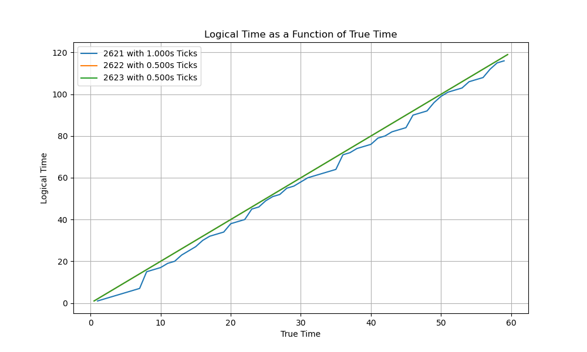
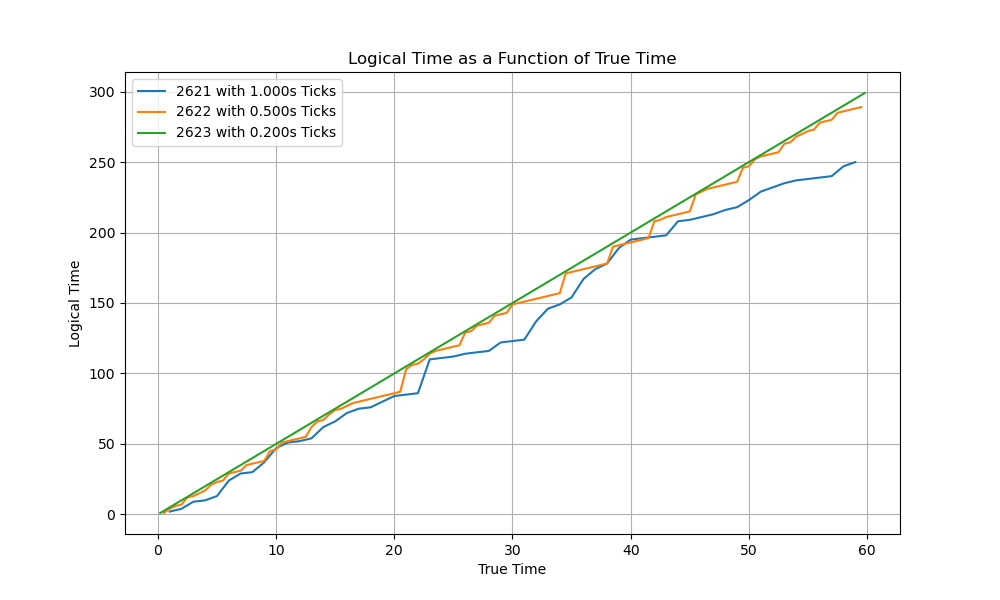
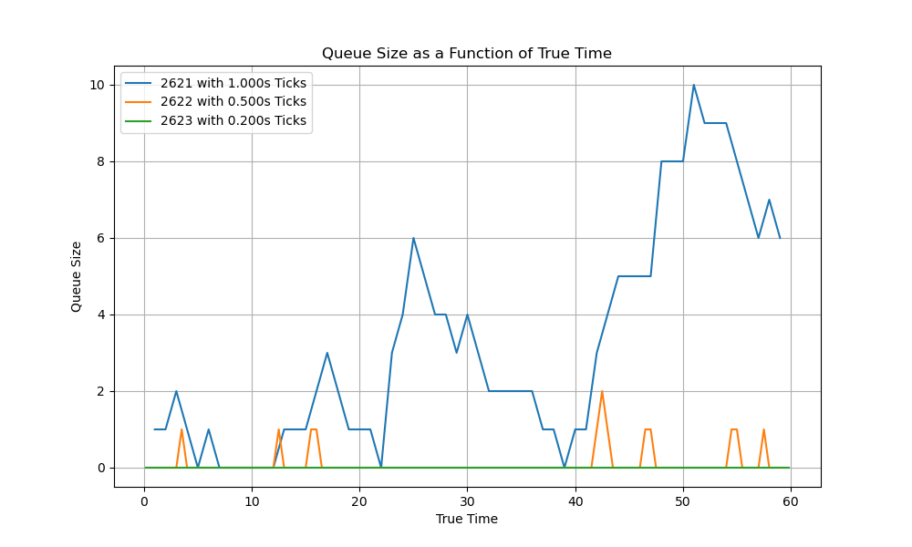
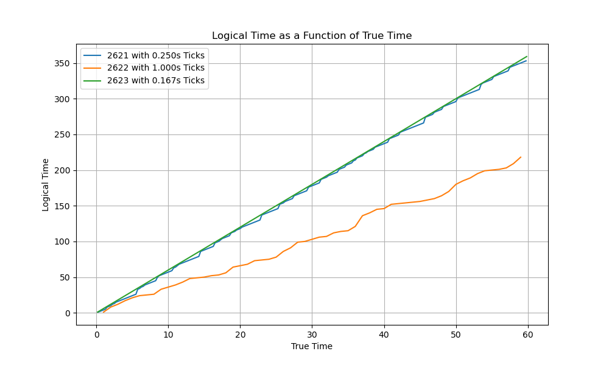
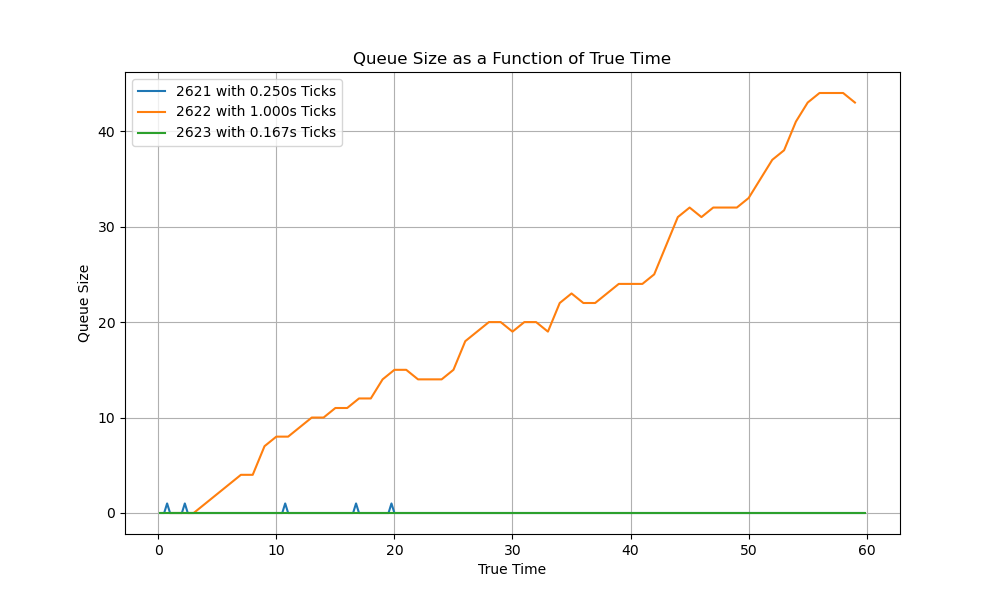
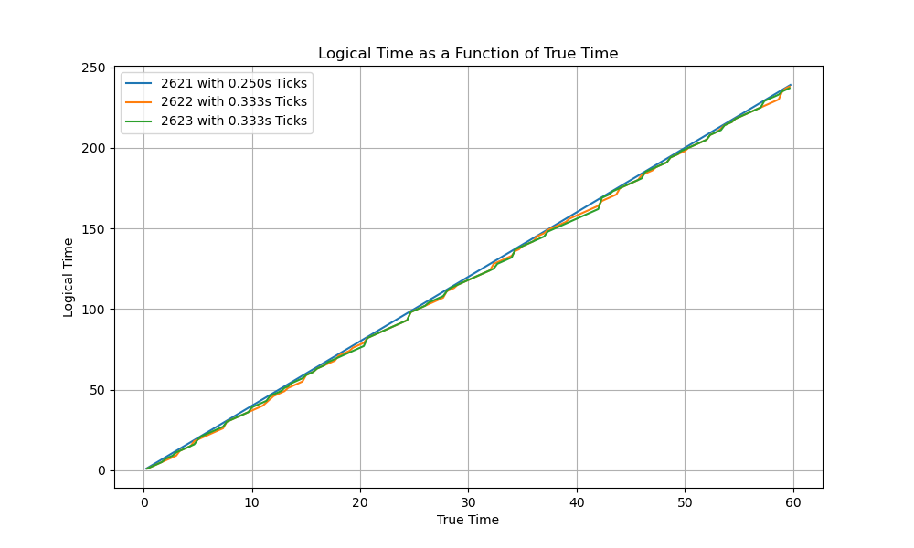
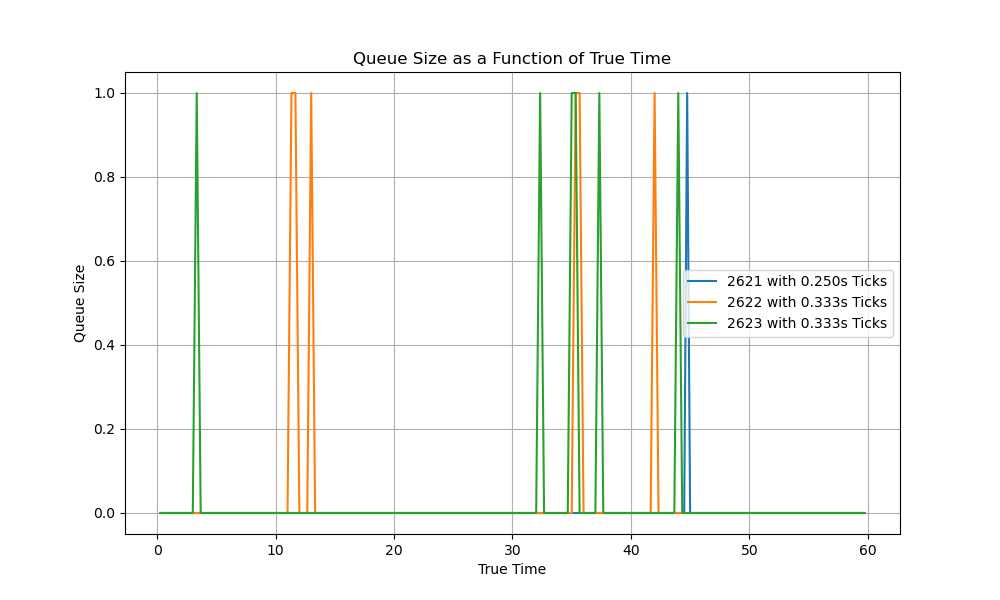

# Engineering Notebook

## File Structure
Each of our processes runs as an instance of `Model.py`. The `Start.sh` shell command concurrently initiates the 3 different processes that make up our model, outputting results in the `Model_Logs` folder. We analyze these results for each trial using `Analysis.py`.

## Model Design

### Wire Protocol
We used a very simple method of communication through sockets for this task. For each message sent to another process, the sender simply sends its own port, logical clock time, and system time separated by spaces and enclosed in newlines.

### Initialization
Upon initialization, each process instantiates their own socket, sets up a selector for incoming message handling, and waits 1 second for the other processes to also connect to their sockets. Then, it connects to the other two processes' sockets and begins maintaining its logical clock and performing the randomized tasks. Each process is also initialized with its own clock rate, and keeps track of the system time (i.e. God's time), starting at 0, which we use to enforce its clock rate.

### Message handling
Each process has its own selector and queue for incoming messages. When there is an incoming message, the selector receives the message and adds it to the queue (independent from its clock cycle). To send a message, the process serializes its port number, logical clock time, and system time for the selector to then sendn out (again independent of system time). 

### Clock Cycle
For each clock cycle (after checking that we are within a minute of system runtime), the process checks that enough time has passed for it to perform its operation and executes its operation according to the specification. If there are any outstanding messages on the queue, it reads the message and then sets its own logical clock time to the higher of its own clock time and the sender's clock time. Otherwise, it generates a random event according to the specified distribution. After performing the operation, the process increments its own logical clock, logs the cycle's information, and sets the time for its next cycle to take place.

## Testing

## Findings

### Standard Trials
Across our 6 trials with the specified clock variation (1-6 cycles per second) and distribtuion (10\% send message to process A only, 10\% send message to process B only, 10\% send message to both, 70\% chance internal operation), we observed the following.

The clock with the fastest tick rate's logical clock is always linear. This makes sense because its logical clock will always be the max of all 3 process, so it will always increment regardless of whether it receives an external communication or not. This is the case if the fastest tick rate is shared by two processes.

Each process's logical clocks are monotonically increasing.

Clock drifts vary across tick rates, generally with a slower tick rate (relative to the fastest tick rate in the trial) corresponding to greater clock drift. Queue sizes also vary across tick rates, generally with a slower tick rate (relative to the fastest tick rate in the trial) corresponding to a greater queue size. This happens because the slowest program is only able to read incoming messages at a fraction of the rate they come in, allowing incoming messages to accumulate because they are being sent in faster than they can be processed. This is why we see slow processes not catch up to the other processes; they are stuck processing older messages, so once their clock jumps to the time that message was sent, the sender's clock has already moved on.

 

We can see an extreme of this in Trail 4. If one of the processes is **much** slower than the other 2, its queue just keeps on filling up because it is not fast enough to process all the incoming messages before more come in. That slow process has a very big clock drift. This means that in a system with even 1 slow process, the logical clock and be off by a lot.

 

If all 3 processes have a close tick rate, the clock drift is pretty small. Because they all of a similar tick rate, their queues don't have time to accumulate that much since they will be able to read incoming messages at a similar rate to which they are coming in.

 

We can see in Trial 1 that with 2 slow processes and 1 fast process, it is easier for the slow processes to get through its queue and "get back on track" (compared to having 2 fast processes and 1 slow procss in Trial 4); messages are being sent at a slower rate on average, so the slow process has more time to clear up its queue.

### Takeaways
Generally, a slower tick rate corresponds to a larger message queue, and a faster tick rate corresponds to a smaller message queue. A greater variation in tick rates generally corresponds to larger clock drift, and a smaller variation corresponds to a smaller clock drift. 

If the processes in a distributed system have very similar times, then a logical clock can be a good way to minimize clock drift; as long as each process can handle incoming messages at about the same rate that they come in, times will by synchronized after not too long, and clock drift will be relatively small. However, if the processing times vary a lot, especially if one of the processes is much slower, the clock drift can get really big and realistically never catch up because the slow process is too slow to ever clear its queue. 
(Note that 1 process being much faster is better than 1 process being much slower, as only having 1 fast process means that messages are only coming in quickly from 1 process, while having 1 slow process means that messages are coming in quickly from every other process).